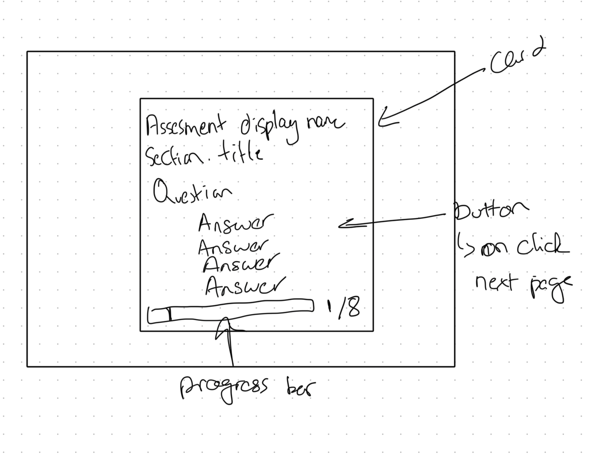

# Assessment Simulator

### Instuctions for running the code locally
1. Clone the repo
2. `cd AssessmentSim/`
3. Build and run the `docker-compose.yml` file: `docker-compose up --build`
4. Once all three services are running, run in a separate terminal: `docker compose run api rails db:create db:migrate db:seed`
5. The app should now be available at `http://localhost:3000/`
   
### Technologies used: Ruby on Rails, Postgres, React, and Docker

#### Ruby on Rails
- I briefly considered Python's FastAPI for spinning up a quick backend to serve the app but ended up going with Rails because of its ease in setting up and interfacing with a database through migrations and `ActiveRecord` models.
  
#### Postgres
- I wanted to use a relational database such as postgres because of the problem stated in part 1. Having to determine the domain mappings of each question is much easier when you can perform joins across relations. Additionally, storing data in the database makes it easier to manage by non code owners; such as editing possible answers to questions through a seperate frontend page.

#### React 
- I chose to use React primarily because of my familiarity with the framework. I like the paradigm of functional components, which I felt made it easier to build the app by allowing the abstraction of common functionality into reusable components. I also wanted to use Material UI (MUI) components to ensure the app looked aesthetically pleasing without spending too much time on styling.

#### Docker
- I chose to containerize both the front and back ends of the app using Docker so that it would be easier to run locally, and eventually deploy. Assuming you have `Docker` and `docker compose` installed, you shouldn't have to worry about installing any other dependencies when starting up the app on a machine.

### Description of the problem and solution

For your reference, I've created three PRs with more specific comments around the code that might be helpful for your review:
1. [Dockerizing the App](https://github.com/Xenox473/AssessmentSim/pull/1)
2. [Part 1 code](https://github.com/Xenox473/AssessmentSim/pull/3)
3. [Part 2 code](https://github.com/Xenox473/AssessmentSim/pull/4)

#### Part 1

The problem described for part 1 was to create an endpoint to return an array of assessments determined from a set of questions and answers sent in as a JSON object. I first got around to setting up the app and database and figuring out which data points I'd like to store in the database and how. Due to the reasons mentioned earlier, I decided to store all the given data into the following tables:
1. `questions`: Holds all the questions with attributes `question_id` and `title`.
2. `answers`: Holds all the possible answer options for the questions with attributes `title` and `value`. (After completing the project, I've realized that answers might be too ambiguous a name and maybe something like `potential_answers` may provide better context).

The intent behind creating these two tables was to allow for the possibility of storing user responses in another table (named `question_answers` or `responses` maybe).

3. `domains`: Held all the provided domains with attributes `name`, `assessment`, and the `minimum_score` required to meet that assessment.
4. `domain_mappings`: This is a join table between the `questions` and `domains` table.

Once the database tables were created and seeded, I could construct an endpoint to receive and process the responses. I created the endpoint `api/assessments/results`which accepted a `POST` request with a JSON payload. With the payload received and the `ActiveRecord` models set, I could use `DomainMapping.find_by(question:).domain.minimum_score` tally up and determine the assesments that met the minimum domain thresholds.

#### Part 2

This part of the problem required creating a questionnaire that asked the users a series of questions one by one to build an array of responses equivalent to the one received by the endpoint in Part 1. I initially sketched out what I thought was the intended design of the layout from the prompt provided.

 

Not the best drawing, but it gets the idea across! From then on I set about creating the view for the first question. I reached my first reusable component with the answers button. Each button was tasked with the same job of sending the `question_id` and `answer.value` to a state value named `responses`. Once I had a functional first step, I created a `QuestionWrapper` component that accepted a question and a list of possible answers. Then, I iterated through the list of questions with an `ActiveQuestionIndex`that incremented whenever an answer was picked. For the progress bar, I imported the `<LinearProgressBar>` component from MUI and assigned the value to be `(activeQuestionIndex / Questions.length) * 100`. I was torn about setting the progress bar to 0 or 1/8 on the first step, but in the end I decided to stick with the former as it felt more intuitive - you'd want the bar to move after you've taken action, not before (I'd think). Once all the questions were asked `(activeQuestionIndex === questions.length)`, the `reponses` state value is sent to the backend. I did add a welcome card at the start of the assessment and a results card at the end which awaits the response from the backend and displays the assessments. It also provides the option to take you back to the welcome screen, providing a seamless user experience.

Once I had things running smoothly, I spent some time styling and refactoring components and variables for improved readability. 

### Describe how you would deploy this as a true production app on the platform of your choice:
  Due to the fact that everything is already containerized through Docker, it should be fairly straight forward to run on a virtual cloud machine such as an EC2 instance. I had tried this approach but due to cost and time reasons, I haven't been able to set one up yet. 
- How would you ensure the application is highly available and performs well?
  - Sticking with the AWS example, it possible to spin up multiple EC2 instances and have a load balancer to distribute all incoming requests equally across instances.
- How would you secure it?
  - Similarly, one can use security groups and a load balancer to limit the ports available to the public and use a service that provide DDOS protection.
  - If the app were to take text inputs in the future, we would need to validate their responses and responsibly design the backend to prevent any malicious attacks through the frontend such as SQL Injections.
  - If we were to end up recording the user's answers and their details, that might fall under HIPAA protection and would needed to be treated with the restrictions the policy demands. Such as anonymizing protected health information (PHI) and encrypting requests between the client and server.
- What would you add to make it easier to troubleshoot problems while it is running live?
  - I would definitely add logging around processes to better understand the state of the application at a particular time.
  - I also believe that the best way to catch problems while the app is running live is to build unit and integration tests that run as part of a CI/CD process that help catch any code changes that might have negative consequences.

### Trade-offs you might have made, anything you left out, or what you might do differently if you were to spend additional time on the project

Some trade-offs I made for the sake of time included:
1. Not paying too much attention to the mobile layout of the application. 
2. All of the frontend requests to the backend reference `localhost:3000/api/` in the url. I'd want to fix that by adding some sort of a proxy so that the requests can be changed to `/api/`. 

### Link to other code you're particularly proud of:
- [Album Review Summarizer](https://github.com/Xenox473/review_summarizer): I used transformer models and embeddings, alongside clustering and graph based algorithms for Retrieval Augmented Generation (RAG) to generate holistic summaries of album reviews from the site https://1001albumsgenerator.com.

[LinkedIn Profile](https://www.linkedin.com/in/avd473/)
